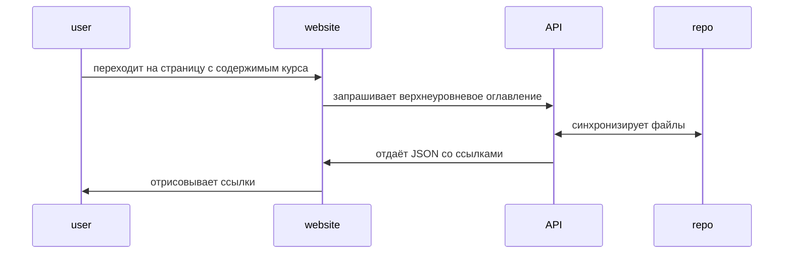
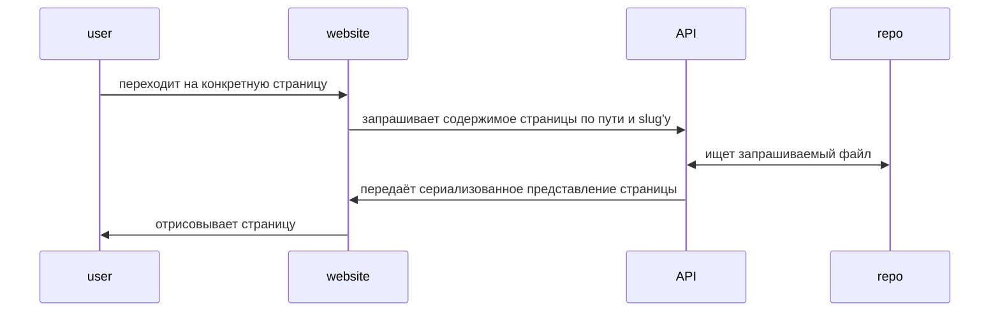

# CMS via GitOps

В этом разделе будет приведена информация о том, каким образом структурировать контент, чтобы он в автоматическом режиме подтягивался с помощью API на сайт.

## Файловая структура

API будет забирать файлы типа Markdown (с расширением `.md`) из папки с названием `chapters`, которая должна находиться в корне репозитория. 
Обрати внимание, что на сайте будут отображены ВСЕ файлы, подходящие под изначальное описание, независимо от того, в какой вложенной папке они находятся.
Каждому файлу `filename.md` будет создаваться свой путь, по которому он будет доступен, с учётом его фактического расположения и следующих правил:
- при названии файла должен быть использован английский язык и предпочтительно строчные буквы
- у каждого файла и папки должен быть двузначный префикс `<digit><digit>_` с помощью которого будет проводиться сортировка (чтобы автоматически отображать на сайте в нужном порядке)

Если, например, на текущим момент файловая структура имеет следующий вид
```
chapters/
|- 00_introduction.md
|- 01/
|  +--- 00_intro.md
|  +--- 01_basics.md
|  +--- 01_basics/
|       +--- 00_html.md
|       +--- 01_js.md
|       +--- 02_css.md
|- 02/
|  +--- 00_intro.md
|  +--- 01_etl.md
|  +--- 01_etl/
|       +--- 00_airflow.md
|       +--- 01_nifi.md
```

то будут доступны следующие статьи:
- articles/introduction
- articles/chapter/01/intro
- articles/chapter/01/basics
- articles/chapter/01/basics/html
- articles/chapter/01/basics/js
- articles/chapter/01/basics/css
- articles/chapter/02/intro
- articles/chapter/02/etl
- articles/chapter/02/etl/airflow
- articles/chapter/02/etl/nifi

## Деплой

Автоматически API будет собирать статьи лишь для двух веток:
- main - production, который будет доступен по основному домену
- dev - тестовая ветка, работу с которой можно будет протестировать, добавляя prefix `dev.` перед основным доменом

Крайне настоятельно рекомендуется избегать коммитов непосредственно в main, так как это может привести некорректным результатам работы

## Общая схема взаимодействия

### Запрос оглавления



### Переход на конкретную страницу


